# chr0nzz

**Developer & self-hosting enthusiast**

I build and maintain open-source tools for the self-hosted homelab community, along with the companion mobile apps that bring those services to your fingertips.

I am passionate about creating seamless, highly functional software with a strong focus on clean, dark-themed, glassmorphism-inspired interfaces that make managing server environments intuitive.

---

## Featured Projects

<table>
  <tr>
    <td>
      
    </td>
    <td>
      
    </td>
  </tr>
  <tr>
    <td>
      
    </td>
    <td>
      
    </td>
  </tr>
</table>

Traefik Manager Mobile is also [available on Google Play](https://play.google.com/store/apps/details?id=dev.chr0nzz.traefikmanager).

---

## Tech Stack

---

## GitHub Stats

