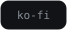

<picture>
  <source media="(prefers-color-scheme: dark)" srcset="./profile/masthead-dark.svg" />
  <source media="(prefers-color-scheme: light)" srcset="./profile/masthead-light.svg" />
  
</picture>

<picture>
  <source media="(prefers-color-scheme: dark)" srcset="./profile/about-dark.svg" />
  <source media="(prefers-color-scheme: light)" srcset="./profile/about-light.svg" />
  
</picture>

  <a href="https://xyzlab.dev"><picture><source media="(prefers-color-scheme: dark)" srcset="./profile/btn-xyzlab-dark.svg" /><source media="(prefers-color-scheme: light)" srcset="./profile/btn-xyzlab-light.svg" /></picture></a>
  <a href="https://ko-fi.com/chr0nzz"><picture><source media="(prefers-color-scheme: dark)" srcset="./profile/btn-kofi-dark.svg" /><source media="(prefers-color-scheme: light)" srcset="./profile/btn-kofi-light.svg" /></picture></a>
  <a href="https://play.google.com/store/apps/details?id=dev.chr0nzz.traefikmanager"><picture><source media="(prefers-color-scheme: dark)" srcset="./profile/btn-play-dark.svg" /><source media="(prefers-color-scheme: light)" srcset="./profile/btn-play-light.svg" /></picture></a>

---

## Featured Projects

<table>
  <tr>
    <td>
      <a href="https://github.com/chr0nzz/traefik-manager">
        <picture>
          <source media="(prefers-color-scheme: dark)" srcset="./profile/pin-traefik-manager-dark.svg" />
          <source media="(prefers-color-scheme: light)" srcset="./profile/pin-traefik-manager-light.svg" />
          
        </picture>
      </a>
    </td>
    <td>
      <a href="https://github.com/chr0nzz/traefik-manager-mobile">
        <picture>
          <source media="(prefers-color-scheme: dark)" srcset="./profile/pin-traefik-manager-mobile-dark.svg" />
          <source media="(prefers-color-scheme: light)" srcset="./profile/pin-traefik-manager-mobile-light.svg" />
          
        </picture>
      </a>
    </td>
  </tr>
  <tr>
    <td>
      <a href="https://github.com/chr0nzz/gatekeeper">
        <picture>
          <source media="(prefers-color-scheme: dark)" srcset="./profile/pin-gatekeeper-dark.svg" />
          <source media="(prefers-color-scheme: light)" srcset="./profile/pin-gatekeeper-light.svg" />
          
        </picture>
      </a>
    </td>
    <td>
      <a href="https://github.com/chr0nzz/traefik-stack">
        <picture>
          <source media="(prefers-color-scheme: dark)" srcset="./profile/pin-traefik-stack-dark.svg" />
          <source media="(prefers-color-scheme: light)" srcset="./profile/pin-traefik-stack-light.svg" />
          
        </picture>
      </a>
    </td>
  </tr>
</table>

## Activity

<picture>
  <source media="(prefers-color-scheme: dark)" srcset="./profile/heatmap-dark.svg" />
  <source media="(prefers-color-scheme: light)" srcset="./profile/heatmap-light.svg" />
  
</picture>

<picture>
  <source media="(prefers-color-scheme: dark)" srcset="./profile/releases-dark.svg" />
  <source media="(prefers-color-scheme: light)" srcset="./profile/releases-light.svg" />
  
</picture>

## Stats

<picture>
  <source media="(prefers-color-scheme: dark)" srcset="./profile/stats-dark.svg" />
  <source media="(prefers-color-scheme: light)" srcset="./profile/stats-light.svg" />
  
</picture>

<picture>
  <source media="(prefers-color-scheme: dark)" srcset="./profile/langs-dark.svg" />
  <source media="(prefers-color-scheme: light)" srcset="./profile/langs-light.svg" />
  
</picture>

<picture>
  <source media="(prefers-color-scheme: dark)" srcset="./profile/stack-dark.svg" />
  <source media="(prefers-color-scheme: light)" srcset="./profile/stack-light.svg" />
  
</picture>

